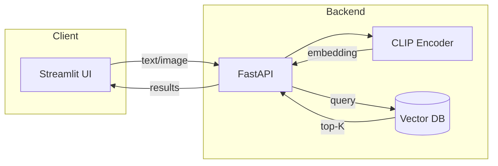

# Product Requirements Document (PRD)

## Project: Multimodal Semantic Image–Text Retrieval System

**Version:** 1.0  
**Last Updated:** February 2025  
**Status:** Draft

---

## Table of Contents

1. [Executive Summary](#1-executive-summary)
2. [Problem Statement](#2-problem-statement)
3. [Goals & Objectives](#3-goals--objectives)
4. [Target Users & Personas](#4-target-users--personas)
5. [User Stories & Acceptance Criteria](#5-user-stories--acceptance-criteria)
6. [User Journeys & Flows](#6-user-journeys--flows)
7. [Functional Requirements](#7-functional-requirements)
8. [Non-Functional Requirements](#8-non-functional-requirements)
9. [Technical Architecture](#9-technical-architecture)
10. [API Specifications](#10-api-specifications)
11. [Data Models](#11-data-models)
12. [Feature Prioritization (MoSCoW)](#12-feature-prioritization-moscow)
13. [Out of Scope](#13-out-of-scope)
14. [Security & Compliance](#14-security--compliance)
15. [Evaluation Metrics & Success Criteria](#15-evaluation-metrics--success-criteria)
16. [Risks, Challenges & Mitigations](#16-risks-challenges--mitigations)
17. [Implementation Timeline & Milestones](#17-implementation-timeline--milestones)
18. [Testing & Validation Plan](#18-testing--validation-plan)
19. [Rollout Strategy](#19-rollout-strategy)
20. [Future Enhancements](#20-future-enhancements)
21. [Appendices](#21-appendices)

---

## 1. Executive Summary

Traditional search systems rely on keyword matching and metadata, which fail to capture semantic meaning. This project aims to build a **multimodal semantic retrieval system** that enables users to search a large image database using natural language queries or retrieve relevant text/captions using image inputs.

The system leverages **CLIP embeddings**, **vector databases**, and **Approximate Nearest Neighbor (ANN)** search to provide scalable, high-performance semantic retrieval. Key differentiators include:

- **Cross-modal understanding** — Text queries match images by meaning, not keywords
- **Scalable architecture** — ANN-based search for 100K+ embeddings with sub-500ms latency
- **Production-ready design** — Containerized, cloud-deployable, with clear APIs and documentation

---

## 2. Problem Statement

### Current State

Current image search systems depend on manually tagged metadata. They:

- **Fail when tags are incomplete or missing** — Unlabeled or sparsely labeled images are unfindable
- **Cannot understand semantic similarity** — "Dog playing in snow" won't match "Husky in winter park" without exact keywords
- **Struggle with cross-modal queries** — Text → image and image → text retrieval require separate, brittle pipelines

### Desired State

We need a system that:

- **Understands semantic meaning** — Matches concepts, not just keywords
- **Works across modalities** — Unified embedding space for text and images
- **Scales to large datasets efficiently** — Sub-second search over 100K+ items

---

## 3. Goals & Objectives

### Primary Goals

| Goal | Description |
|------|-------------|
| **Semantic Retrieval Engine** | Build a production-capable semantic image–text retrieval engine |
| **Cross-Modal Search** | Enable text-to-image and image-to-image search with high recall |
| **Scalable ANN Search** | Implement scalable ANN-based vector search (HNSW) |
| **Cloud Demo** | Deploy a working cloud-based demo accessible via web UI |

### Secondary Goals

- Benchmark retrieval performance (Recall@K, mAP)
- Optimize query latency for real-time interaction (< 500ms p95)
- Design modular, maintainable, production-ready architecture

### Success Metrics (Measurable)

- Recall@10 ≥ 0.85 on held-out validation set
- p95 query latency < 500ms
- System handles 100K+ indexed embeddings
- API uptime ≥ 99% during demo period

---

## 4. Target Users & Personas

| Persona | Use Case | Key Needs |
|---------|----------|-----------|
| **ML Engineer** | Exploring embeddings and vector search for projects | Reproducible setup, benchmarking tools, extensible APIs |
| **Researcher** | Studying multimodal learning, prototyping ideas | Clear technical docs, dataset flexibility, evaluation scripts |
| **Recruiter / Evaluator** | Assessing applied ML engineering skills | Working demo, clean codebase, architecture clarity |
| **Developer** | Building recommendation or RAG systems | REST API, Docker images, integration examples |

---

## 5. User Stories & Acceptance Criteria

### US-1: Text-to-Image Search

**As a** user, **I want to** search for images using a natural language query **so that** I can find semantically relevant images without relying on tags.

| ID | Acceptance Criteria | Priority |
|----|---------------------|----------|
| AC-1.1 | User can enter free-form text in a search box | Must |
| AC-1.2 | System returns top-K images ranked by semantic similarity | Must |
| AC-1.3 | Results include image thumbnails and similarity scores | Must |
| AC-1.4 | Empty or invalid query shows clear error message | Must |
| AC-1.5 | Query length supports at least 77 tokens (CLIP limit) | Must |

### US-2: Image-to-Image Search

**As a** user, **I want to** upload an image and find similar images **so that** I can discover visually or semantically related content.

| ID | Acceptance Criteria | Priority |
|----|---------------------|----------|
| AC-2.1 | User can upload an image file (JPEG, PNG, WebP) | Must |
| AC-2.2 | System returns top-K similar images with scores | Must |
| AC-2.3 | Supported max file size: 10MB | Must |
| AC-2.4 | Invalid format or corrupted file shows clear error | Must |

### US-3: API Consumption

**As a** developer, **I want to** call REST endpoints for search **so that** I can integrate retrieval into my applications.

| ID | Acceptance Criteria | Priority |
|----|---------------------|----------|
| AC-3.1 | `/search-text` accepts JSON body with `query` and `top_k` | Must |
| AC-3.2 | `/search-image` accepts multipart form with image file | Must |
| AC-3.3 | Responses include `results` array with `id`, `score`, `metadata` | Must |
| AC-3.4 | `/health` returns service status and DB connectivity | Must |
| AC-3.5 | API returns appropriate HTTP status codes (200, 400, 500) | Must |

### US-4: Index Management

**As an** operator, **I want to** verify that the index is healthy **so that** I can ensure retrieval quality.

| ID | Acceptance Criteria | Priority |
|----|---------------------|----------|
| AC-4.1 | Health endpoint reports vector DB connection status | Should |
| AC-4.2 | Index stats (count, dimension) accessible for monitoring | Should |

---

## 6. User Journeys & Flows

### Journey 1: Text Search (Happy Path)

```
User opens app → Enters "dog playing in snow" → Clicks Search →
  Backend encodes query → ANN search → Returns top 10 images →
  UI displays grid of results with scores
```

### Journey 2: Image Search (Happy Path)

```
User opens app → Clicks "Upload Image" → Selects file →
  Backend encodes image → ANN search → Returns top 10 images →
  UI displays grid of results with scores
```

### Journey 3: Error Handling

```
User submits empty query → API returns 400 with message "Query cannot be empty" →
  UI displays inline error, does not clear input
```

### Flow Diagram (High-Level)



---

## 7. Functional Requirements

### 7.1 Data Processing

| ID | Requirement | Notes |
|----|-------------|-------|
| FR-1.1 | Load dataset (MS-COCO or Flickr30k) | Support configurable dataset path |
| FR-1.2 | Generate embeddings using CLIP | Batch processing for efficiency |
| FR-1.3 | Normalize embeddings (L2) | Required for cosine similarity |
| FR-1.4 | Persist image IDs and metadata | For result display and debugging |

### 7.2 Embedding & Indexing

| ID | Requirement | Notes |
|----|-------------|-------|
| FR-2.1 | Encode images using CLIP image encoder | OpenCLIP ViT-B/32 |
| FR-2.2 | Encode text using CLIP text encoder | Same model, shared space |
| FR-2.3 | Store embeddings in vector DB | Pinecone or Milvus |
| FR-2.4 | Index using HNSW (or equivalent) | Configurable parameters |
| FR-2.5 | Use cosine similarity metric | After L2 normalization |

### 7.3 Retrieval

| ID | Requirement | Notes |
|----|-------------|-------|
| FR-3.1 | Accept text query input | Max length per CLIP |
| FR-3.2 | Accept image upload input | JPEG, PNG, WebP |
| FR-3.3 | Convert query to embedding | Same pipeline as indexing |
| FR-3.4 | Perform ANN similarity search | Configurable top-K |
| FR-3.5 | Return top-K results with metadata | id, score, url/path |

### 7.4 API Layer

| ID | Requirement | Notes |
|----|-------------|-------|
| FR-4.1 | Expose REST API via FastAPI | See §10 for spec |
| FR-4.2 | CORS enabled for Streamlit origin | Configurable |
| FR-4.3 | Request validation via Pydantic | Clear error responses |

### 7.5 Frontend

| ID | Requirement | Notes |
|----|-------------|-------|
| FR-5.1 | Streamlit-based UI | Single-page layout |
| FR-5.2 | Text query input | With search button |
| FR-5.3 | Image upload (file picker) | Drag-and-drop or browse |
| FR-5.4 | Display ranked results | Grid, with scores |
| FR-5.5 | Loading and error states | User feedback for async ops |

---

## 8. Non-Functional Requirements

| Category | Requirement | Target |
|----------|-------------|--------|
| **Performance** | Query latency (p95) | < 500ms |
| **Scalability** | Index size | 100K+ embeddings |
| **Availability** | Uptime (demo) | ≥ 99% |
| **Maintainability** | Code structure | Modular, documented |
| **Reproducibility** | Setup | Docker Compose, requirements.txt |
| **Deployment** | Packaging | Containerized (Docker) |
| **Throughput** | Concurrent requests | 10+ req/s sustained |
| **Memory** | Embedding model load | < 2GB RAM |

---

## 9. Technical Architecture

### 9.1 High-Level Architecture

```
┌─────────────────────────────────────────────────────────────────────┐
│                         Client Layer                                  │
│  ┌──────────────────────────────────────────────────────────────┐   │
│  │                    Streamlit Frontend                          │   │
│  │  (Text Input | Image Upload | Results Grid)                   │   │
│  └──────────────────────────────────────────────────────────────┘   │
└─────────────────────────────────────────────────────────────────────┘
                                    │
                                    │ HTTP/REST
                                    ▼
┌─────────────────────────────────────────────────────────────────────┐
│                         API Layer                                     │
│  ┌──────────────────────────────────────────────────────────────┐   │
│  │                    FastAPI Server                             │   │
│  │  /search-text | /search-image | /health                       │   │
│  └──────────────────────────────────────────────────────────────┘   │
└─────────────────────────────────────────────────────────────────────┘
                                    │
            ┌───────────────────────┼───────────────────────┐
            ▼                       ▼                       ▼
┌───────────────────┐   ┌───────────────────┐   ┌───────────────────┐
│   CLIP Encoder    │   │   Embedding       │   │   Vector DB       │
│   (OpenCLIP       │   │   Service         │   │   (Pinecone /     │
│   ViT-B/32)       │   │   (normalize)     │   │   Milvus)         │
└───────────────────┘   └───────────────────┘   └───────────────────┘
```

### 9.2 Core Components

| Component | Technology | Purpose |
|-----------|------------|---------|
| **Embedding Model** | OpenCLIP (ViT-B/32) | Unified text/image embeddings |
| **Vector Database** | Pinecone or Milvus | HNSW indexing, cosine similarity |
| **Backend** | FastAPI | REST API, validation, async I/O |
| **Frontend** | Streamlit | Quick UI for demo |
| **Deployment** | Docker, Cloud Run / Lambda | Containerized, scalable |

### 9.3 Data Flow

1. **Indexing (offline)**: Dataset → CLIP encoder → L2 normalize → Vector DB
2. **Query (online)**: Text/Image → CLIP encoder → L2 normalize → ANN search → Top-K

### 9.4 Deployment Topology

- **Local**: Docker Compose (API + Vector DB + optional Streamlit)
- **Cloud**: API on Cloud Run / Lambda; Vector DB managed (Pinecone) or self-hosted (Milvus)

---

## 10. API Specifications

### 10.1 Base URL

- Local: `http://localhost:8000`
- Prefix: `/api/v1` (recommended)

### 10.2 Endpoints

#### POST `/search-text`

Search images by natural language query.

**Request**

```json
{
  "query": "dog playing in snow",
  "top_k": 10
}
```

| Field | Type | Required | Description |
|-------|------|----------|-------------|
| query | string | Yes | Natural language search query (1–77 tokens) |
| top_k | integer | No | Number of results (default: 10, max: 100) |

**Response (200)**

```json
{
  "query": "dog playing in snow",
  "results": [
    {
      "id": "img_001",
      "score": 0.892,
      "metadata": {
        "url": "https://...",
        "caption": "A dog in the snow"
      }
    }
  ],
  "latency_ms": 120
}
```

**Errors**

- `400`: Invalid or empty query
- `500`: Server/DB error

---

#### POST `/search-image`

Search images by uploaded image.

**Request**

- Content-Type: `multipart/form-data`
- Body: `file` (image), optional `top_k` (integer)

**Response (200)**

```json
{
  "results": [
    {
      "id": "img_002",
      "score": 0.945,
      "metadata": {
        "url": "https://...",
        "caption": "Husky in winter"
      }
    }
  ],
  "latency_ms": 95
}
```

**Errors**

- `400`: Missing file, unsupported format, file too large
- `500`: Server/DB error

---

#### GET `/health`

Health check.

**Response (200)**

```json
{
  "status": "healthy",
  "vector_db_connected": true,
  "index_stats": {
    "total_vectors": 123456,
    "dimension": 512
  }
}
```

---

## 11. Data Models

### 11.1 Embedding

| Field | Type | Description |
|-------|------|-------------|
| id | string | Unique image/record ID |
| vector | float[512] | L2-normalized CLIP embedding |
| metadata | object | url, caption, split, etc. |

### 11.2 Search Result

| Field | Type | Description |
|-------|------|-------------|
| id | string | Image ID |
| score | float | Similarity score (0–1, higher = more similar) |
| metadata | object | url, caption, etc. |

### 11.3 Index Metadata

| Field | Type | Description |
|-------|------|-------------|
| dimension | int | 512 (ViT-B/32) |
| metric | string | "cosine" |
| index_type | string | "hnsw" |

---

## 12. Feature Prioritization (MoSCoW)

| Priority | Feature | Rationale |
|----------|---------|-----------|
| **Must** | Text-to-image search | Core value proposition |
| **Must** | Image-to-image search | Core value proposition |
| **Must** | REST API for search | Integration and automation |
| **Must** | Streamlit UI | Demo and evaluation |
| **Must** | Vector DB indexing | Enables scalable search |
| **Should** | Health endpoint | Operational visibility |
| **Should** | Configurable top_k | Flexibility for use cases |
| **Could** | Batch embedding script | Easier re-indexing |
| **Won't (v1)** | User authentication | Not required for demo |
| **Won't (v1)** | Real-time indexing | Offline batch only for v1 |

---

## 13. Out of Scope

The following are explicitly **not** in scope for v1:

- **User authentication / authorization** — Open demo
- **Real-time or incremental indexing** — Batch-only indexing
- **Video or audio inputs** — Image and text only
- **Keyword + vector hybrid search** — Pure vector retrieval
- **Fine-tuned or custom CLIP models** — OpenCLIP pretrained only
- **Multi-tenant or enterprise features** — Single-tenant demo

---

## 14. Security & Compliance

### 14.1 Security

| Area | Approach |
|------|----------|
| **Input validation** | Pydantic schemas, file type/size limits |
| **Rate limiting** | Optional; apply in production deployment |
| **Data in transit** | HTTPS in production |
| **Secrets** | Env vars / secrets manager for API keys (e.g., Pinecone) |
| **Image upload** | Validate MIME type, max 10MB, no executable content |

### 14.2 Compliance

- No PII stored beyond image URLs/captions from public datasets
- Dataset licensing: MS-COCO / Flickr30k used per their terms
- No special regulatory requirements assumed for demo

---

## 15. Evaluation Metrics & Success Criteria

### 15.1 Retrieval Quality

| Metric | Target | Measurement |
|--------|--------|-------------|
| Recall@10 | ≥ 0.85 | On held-out validation set |
| mAP | ≥ 0.80 | Mean Average Precision |
| Recall@1 | ≥ 0.65 | Top-1 accuracy |

### 15.2 Performance

| Metric | Target | Measurement |
|--------|--------|-------------|
| p95 query latency | < 500ms | From API request to response |
| p50 query latency | < 200ms | Typical case |
| Throughput | 10+ req/s | Sustained load |

### 15.3 Operational

| Metric | Target |
|--------|--------|
| Uptime | ≥ 99% (demo period) |
| Index size | 100K+ embeddings supported |
| Cold start (model load) | < 30s |

### 15.4 Success Criteria (Go/No-Go)

- [ ] End-to-end working demo (text + image search)
- [ ] Recall@10 ≥ 0.85 on validation split
- [ ] p95 latency < 500ms
- [ ] Deployed to cloud with public URL
- [ ] README with setup, run, and benchmark instructions

---

## 16. Risks, Challenges & Mitigations

| Risk | Impact | Likelihood | Mitigation |
|------|--------|------------|------------|
| Embedding normalization inconsistencies | Wrong similarity scores | Medium | Standardize L2 norm in single pipeline |
| ANN parameter tuning | Latency/accuracy tradeoff | Medium | Use defaults first; document tuning guide |
| Vector DB downtime | Service unavailable | Low | Use managed DB; health checks |
| Large-scale indexing latency | Slow indexing | Medium | Batch processing; consider parallel workers |
| Cloud cost overrun | Budget | Low | Use serverless/spot; monitor usage |
| CLIP limit (77 tokens) | Long queries truncated | Low | Document limit; truncate with warning |

---

## 17. Implementation Timeline & Milestones

| Phase | Duration | Deliverables |
|-------|----------|--------------|
| **M1: Setup & Data** | 1 week | Project structure, dataset loading, CLIP integration |
| **M2: Indexing** | 1 week | Embedding pipeline, vector DB integration, HNSW index |
| **M3: API** | 1 week | FastAPI endpoints, validation, error handling |
| **M4: Frontend** | 1 week | Streamlit UI, search flows, result display |
| **M5: Eval & Deploy** | 1 week | Benchmarks, Docker, cloud deployment |
| **M6: Docs & Polish** | 0.5 week | README, API docs, runbook |

**Total estimated effort:** ~5.5 weeks (single developer)

---

## 18. Testing & Validation Plan

| Level | Scope | Approach |
|-------|-------|----------|
| **Unit** | Encoder, normalization, parsers | pytest, mocked CLIP |
| **Integration** | API + Vector DB | pytest + test index |
| **E2E** | Full search flow | Manual / Playwright (optional) |
| **Performance** | Latency, throughput | locust / k6 scripts |
| **Retrieval** | Recall@K, mAP | Evaluation script on val set |

### Key Test Cases

- Text search: valid query → 200 + results
- Text search: empty query → 400
- Image search: valid file → 200 + results
- Image search: invalid format → 400
- Health: returns 200 when DB connected

---

## 19. Rollout Strategy

| Stage | Description |
|-------|-------------|
| **Alpha** | Local Docker run; internal validation |
| **Beta** | Cloud deployment; limited external access |
| **GA** | Public demo URL; documentation finalized |

### Rollback

- Revert to previous Docker image
- Vector DB index unchanged; no data migration for rollback

---

## 20. Future Enhancements

| Enhancement | Description | Priority |
|-------------|-------------|----------|
| Hybrid search | Keyword + vector filtering | High |
| Domain fine-tuning | Fine-tune CLIP on custom data | Medium |
| RAG integration | Caption generation for results | Medium |
| Real-time indexing | Add new images without full re-index | Medium |
| Personalized retrieval | User preference signals | Low |

---

## 21. Appendices

### A. Glossary

| Term | Definition |
|------|------------|
| ANN | Approximate Nearest Neighbor |
| CLIP | Contrastive Language-Image Pre-training |
| HNSW | Hierarchical Navigable Small World (ANN algorithm) |
| mAP | Mean Average Precision |
| Recall@K | Fraction of relevant items in top-K results |

### B. References

- [CLIP Paper](https://arxiv.org/abs/2103.00020)
- [OpenCLIP](https://github.com/mlfoundations/open_clip)
- [Pinecone](https://www.pinecone.io/) / [Milvus](https://milvus.io/)

### C. Document History

| Version | Date | Author | Changes |
|---------|------|--------|---------|
| 1.0 | Feb 2025 | — | Initial comprehensive PRD |

---

*End of PRD*
